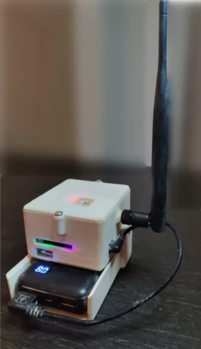
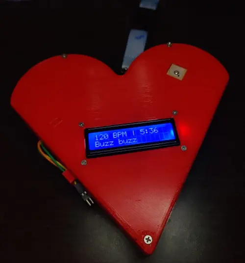
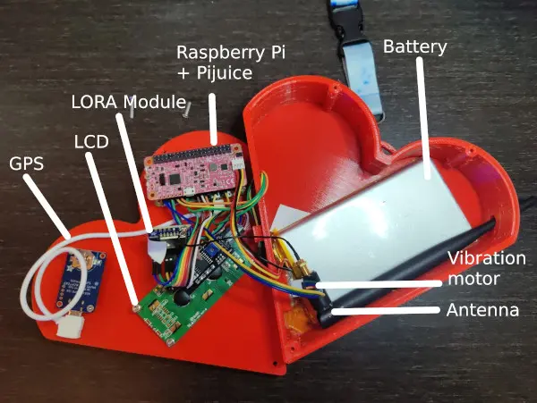
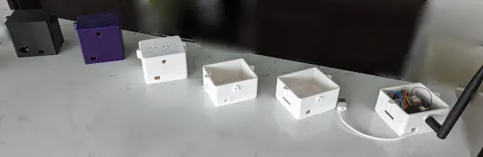

Or: my brief career as an interactive artist

---

::: tip 
See the code on BitBucket:
* [Allora](https://bitbucket.org/_Blue/allora/src/master/)
* [Brulix](https://bitbucket.org/_Blue/brulix/src/master/)
* [Brulapp](https://bitbucket.org/_Blue/brulapp/src/master/)
* [Brulixcase (3D models)](https://bitbucket.org/timst2/brulixcase/src/main/)
:::

In early 2022, my friend and I decided to go to Burning Man. Now the thing is, Burning Man has a lot of interesting things to see, interesting people, and interesting events, but there is one thing it doesn’t have: phone coverage. Some say that it’s part of the appeal, and that not using your phone during the event helps you work toward one of Burning Man’s guiding principles, **Immediacy**. Undistracted by social media and the affairs of the default world, you’re free to engage deeper with your surroundings.

And I mean, yeah, sure, but wouldn’t it be nice to be able to tell your friend about this cool thing happening on Esplanade right now? Or that you’re in a sticky situation and need help? And what if communication technology could actually help people connect in the real world, for once? This and many other reasons (mainly the cool factor) are what led to the creation of project Brulix: a mobile-connected, Raspberry Pi-powered, communication device that uses radio waves (specifically the LoRa tech) to send and receive binary packets, just like a phone would. Let’s explore how we did it.

## Design
We actually came up with two separate ideas using the same technological stack.

Our first idea for the project was a personal device that you would carry with you and that would let you chat with other users and see their location using your phone. This device would need to be small enough to be carried in a bag or satchel, and rugged enough to withstand the playa’s heat and dustiness. It would also need to have both an internal battery and some sort of swappable, external battery, so that we wouldn’t have to charge it all the time.

<figure>
  
  <figcaption>A ‘personal’ device</figcaption>
</figure>

The second and arguably more interesting application was our “offering” to the playa. Participants to Burning Man are encouraged to bring something that they’ve made (usually) and share it with others (“**Gifting**” is another core principle). Our concept here was to make pairs of heart-shaped boxes. The hearts would talk to each other and track the other heart’s position. Using this information, a screen would tell the heart’s owner about how far the other heart currently is (we would measure the distance as beats per minute rather than as feet or meters, from 40 bpm (far) to 250 bpm (very close)). In addition, we had a vibration engine to make the heart buzz at that rate, adding tactile feedback to the experience.

<figure>
  
  <figcaption>A ‘beating’ heart</figcaption>
</figure>

Designing and building this device turned out to be slightly more complicated given the increased number of components, and the heartistic shape. To save space we decided to put components on both the front and the back wall, which made assembling it much harder. Look at the following picture and try to imagine if everything fits once closed (it does, but barely).

<figure>
  
  <figcaption>The insides of a heart</figcaption>
</figure>

The idea was that we would each find two random people, explain this concept, give them a heart each, and let them loose on the playa. Once they found each other, they could connect the hearts using a dedicated cable, at which point a message on the screen would appear instructing them to visit us at our camp. Once there, we would give them one of these breakable heart pendants as a memento of the experience.

Basically every component required extensive research and testing. We eventually landed on:
* A [Raspberry Pi Zero 2 W](https://www.raspberrypi.com/products/raspberry-pi-zero-2-w/) as the base board
* [PiJuice](https://www.raspberrypi.com/news/pijuice/) and PiJuice Zero as battery platforms
* A 10000 mAh off-the-shelf battery pack for the personal device, and [12000 mAh PiJuice battery](https://www.pishop.us/product/pijuice-12000mah-battery/) for the heart
* The [Adafruit Ultimate GPS GNSS with USB](https://www.adafruit.com/product/4279) for the personal device, and [VK-162 G-Mouse USB GPS Dongle](https://www.amazon.com/Navigation-External-Receiver-Raspberry-Geekstory/dp/B078Y52FGQ?th=1) for the heart
* The [Adafruit RFM95W LoRa Radio Transceiver](https://www.adafruit.com/product/3072)
* A [GeeekPi I2C 1602 LCD Display Module](https://www.amazon.com/gp/product/B07S7PJYM6)
* A [Grove Vibration Motor](https://wiki.seeedstudio.com/Grove-Vibration_Motor/)
* Very short [USB cables](https://www.amazon.com/gp/product/B07KP6NTK7/), plus jumper cables for GPIO connections

## Modeling and printing the cases, sourcing the parts
After briefly considering getting off-the-shelf cases, we realized that it would be better to make our own. We had access to a shared maker space with a 3D printer, so I downloaded Fusion360 and, after some confusion, managed to make a serviceable box, which we then iterated on at least 60 times until reaching this:

<figure>
  
  <figcaption>A few iterations of the case design</figcaption>
</figure>

## Allora and Brulix
Being able to send and receive bytes over radio signals is great, but being able to do it in a reliable and performant way is tricky. In total we deployed 8 devices on Playa, and they need to be able to “talk” to each other on our radio network. This functionality was provided by the [LoRa](https://en.wikipedia.org/wiki/LoRa)-based networking stack we built: Allora.

The key features we needed were:

* Message Encryption and Authentication
* One-to-one communication channel, with acknowledged packets and retransmission
* One-to-many or “broadcasts” channels

To achieve this, Allora needs to send metadata along with the packets being sent and keep track of the state of each connection and messages. This networking stack functions in 4 layers:

* L1: The hardware layer, where packets are written and read from the actual radio device
* L2: The transport layer, which handles the addressing of packets (source, destination, ttl’s, ..)
* L3: The channel layer, where the state of connections and pending transactions are kept
* L4: The application layer

A typical Allora packet contains the following metadata:

* Source device
* Destination device (or 0xf for a broadcast packet)
* Channel id
* Time-to-live
* Flags

Given the distributed nature of our radio network, it’s possible that two devices are out of range of their own radio devices, but are both in range of another device. To allow devices to talk outside of their own radio ranges, each packet has a time-to-live (ttl) field. This field defines how many ‘hops’ a packet can make before being dropped. If a device receives a packet that’s not addressed to itself, it will decrement the ttl and will send the packet again as long as the resulting ttl is greater than zero.

Overall, Allora was a very teaching experience on how to design in a networking stack from scratch. Keeping track of transactions, handling retransmissions of lost packets, and ensuring that the state of a connection is consistent between two devices required many iterations of the protocol and its implementation which ultimately lead to a networking stack that replicates a simplified version of TCP/IP.

On top of allora lies Brulix, which provides all the functionality that our devices need, namely:

* Exposing a REST API endpoint that can be used to manage the device via a mobile app
* Sending and receiving text messages to other devices
* Regularly acquire GPS coordinates from a GPS chip and broadcast it on the network
* Receive GPS coordinates from other devices
* Control the display of the heart’s screen, its vibration engine, and its connector
* Keep track of the state of the battery

Brulix runs as a simple systemd unit, which starts at boot and reads a YAML configuration file to determine which features are supposed to run (since we have 3 different kinds of devices: hearts, personal devices, and relays). With this configuration based system we can share the same codebase between all the devices.

## Mobile apps
Our devices needed to be manageable without having to carry a laptop around. We considered different approaches (such as having a screen and buttons, or a miniature keyboard on the devices themselves), but having a mobile application running on a phone turned out to be the simplest alternative.

Each device would run a wifi network with the device’s name as the SSID which we could connect our phone to. Once connected we could use the application to send messages, see where the other devices are on the map, and run debugging & maintenance tasks on each device, which turned out extremely useful to diagnose issues and run tests.

## How did it perform in the real world?
We ran a whole bunch of tests that typically involved driving out to the sticks and looking insanely suspicious as we walked around fields and country roads with bins full of electronic components. During these tests, we observed a range of up to 3km (~2mi), which should have been plenty to cover virtually the entirety of Burning Man, even from our fairly off-center home base at 3&G. Reception was spotty at extreme range, but it was working.

Now, it’s hard to replicate Burning Man’s conditions in the default world, especially when you live in wet and densely populated Western Washington. The open fields were an ok approximation, but they tended to have more elevation changes, more trees, and, more importantly, a lot fewer people, structures and vehicles than Burning Man. On the other hand, we usually ran tests with the large antenna on the ground by the car, whereas at the event, we were able to stick our antenna atop a 2m/6ft high platform, which should have made a pretty big difference.

So how did it all work out in the end? Quite poorly. The observed range was closer to a 300m radius around our camp, so a tenth of what we had seen in tests. That sort of range would work for the hearts project (any longer range would have been impracticably difficult anyway), but it made the personal devices a lot less useful.

<figure>
  
  <figcaption>In blue: estimated range. In red: actual range.</figcaption>
</figure>

It’s hard to give a conclusive answer as to why the range was so limited, but it likely has to do with the sheer amount of metal structure and vehicles at Burning Man. The entire area is saturated with box trucks, RVs, SUVs, platforms and scaffolding, art cars, steel sculptures, etc., all of which probably interfere with the signal.

On top of the range issue, the personal devices had to be carried around, the battery had to be swapped and charged, there were occasional reliability or connection issues… all of which meant that they were mostly only used for their “tracking” capability, and not so much for communication.

We did, however, try out the hearts. In the end, time constraints meant that we only used one of the pairs. We first did a final test with just the two of us. Finding each other in the busy streets of Black Rock City took a little while, but we eventually managed. The system was working as it should.

We then ran a limited real world test, giving the hearts to two people on the same street, maybe 50m/150ft apart. After a few minutes, they found each other and we proceeded with the ceremony. We took a picture, gave them the pendants, the works.

It was pretty satisfying to see the process work end to end, but we knew that it was a simplified version of the real thing. So for our next attempt, we picked people who were much farther away from each other – around 150m/500ft, and on different streets. Still in the same neighborhood as far as Burning Man goes, but definitely a higher challenge. Both of the people seemed relatively motivated and seemed to set out to find the other one.

One of the hearts almost immediately left range and never resurfaced. The other one ended up in an RV in our neighborhood, and stayed there until the battery died. That was it. It was disappointing, but we knew to expect something like that. There is a lot going on at Burning Man, and it’s tough to ask someone to drop whatever they’re doing and embark on this new quest. They probably tried for a little bit, got distracted, thought “I’ll get to that later”, and as it often does on playa, that moment never came.

## Conclusion and future work
Even though only half of our hearts made it back home, Brulix was both a fantastic technical and human experience.
Learning to build such devices taught us a lot from picking components, to writing drivers, protocols, CAD software, 3D design, automated tests all the way to the user experience, and how to make sure that people understand how the game works, when they win, how to get hearts back, …

Now that we have built the platform to create such devices, iterating to improve the hearts, the network and the gameplay is where we’re heading.
May our hearts create more connections between strangers!

————

Project and blog post co-created with my friend Blue. This post was originally published on [his blog](https://bluecode.fr/brulix.html).