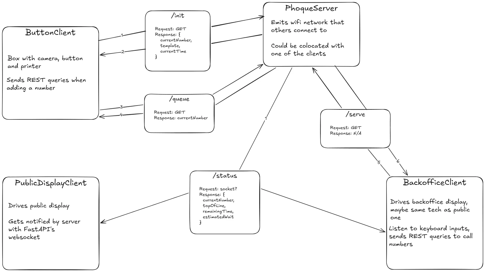
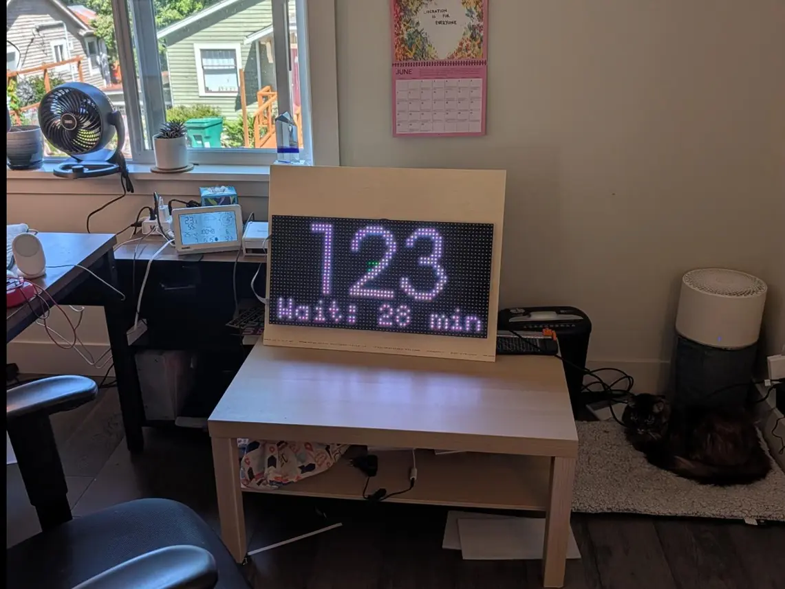

Bringing the magic of the DMV to Burning Man

---

::: tip 
See the code on GitHub:
* [Phoque v1](https://github.com/Timst/phoque)
* [Phoque v2 (WIP)](https://github.com/Timst/Phoque2)
:::

A smaller project that I made ahead of my first time at Burning Man, aside from the much more complicated [Brulix](brulix.md) system, was a queuing system for our camp, which served phở. Hence, **Phoque**, a combination of pho and queue. Which yes, combines poorly. Also, phoque means sealion in French. This doesn't matter at all but it's something. Also, the pho angle is no longer relevant, as I now co-lead a camp that makes crêpes, but whatever, I'm keeping the name.

If you haven't been to Burning Man, or even if you have, it might not be immediately obvious what the benefits of a queue organization system could be. In fact, many camps don't bother at all, and just have people form a line and wait for their turn. Now the thing is, in our case that wait can be as long as an hour. I don't know if you've ever waited one hour under a 100°F sun while very hungry, but I have, and let me tell you that it is not fun. Hence, this thing.

## What it do?
This is a comprehensive (read: over-engineered) line management system. Here's the workflow:

* People slam a big red button (I'll go over the hardware later)
* This takes a picture of them on a webcam, and prints it on a receipt along with a number
* Meanwhile, we're crêpin'. When a crêpe is ready, we press a "call" button
* This makes an audio announcement (text-to-speech, using [pyttsx3](https://pypi.org/project/pyttsx3/)), and increments the current number on a public-facing screen, so that people know where we're at
* On our side, along with the call button, we also see a screen that lets us know the state of the line (current number, max number, estimated wait, etc)

Numbers are tracked in a database so you can later make little charts and stuff (I haven't, but, you know, you could). There is also a "photobooth" mode that strips out the numbering stuff but adds a viewfinder. That's cool at parties.

Note that you strictly speaking don't need to use a thermal receipt printer: any old printer would do. But thermal printers are fast (the whole thing takes about one second from button press to the receipt being out, and that's mostly throttled by the system), and thermal paper rolls are inexpensive, plus they don't require ink or toner. So that essentially makes this a (very low res) instantaneous photobooth.

Here it is in motion:

<video width="100%" controls>
  <source src="../assets/phoque/phoque.mp4" type="video/mp4">
  Your browser does not support the video tag.
</video>

## Hardware
This is meant to run on a Raspberry Pi. I've been using a Pi 4B, this would likely also work on a 5 or on an older Pi.

Besides that, the big items you'll need if you want to build this at home is a button ([this](https://www.amazon.com/gp/product/B00XRC9URW/) is the one I use), a webcam (anything will do, I use this logitech cam that everybody has), a thermal receipt printer (that's the most specialized and expensive piece of kit; I use [this MUNBYN printer](https://www.amazon.com/dp/B0779WGYHS)), a keyboard, and maybe a couple of screens. For the backoffice, I use a [tiny display](https://www.amazon.com/dp/B09MFNLRQQ?th=1) meant specifically to work with Raspberry Pi. For the large number display, I got a cheap TV off FB Marketplace. I also use a [mini 4-key keyboard](https://www.amazon.com/dp/B093WJ38D9) for the queue controls (call the next number, skip it, reset the count, etc.)

[Here](https://docs.google.com/document/d/1qJzJxlinTLHUv-rM7RpuQfxlVQy0EvKh1EnHSkjROCY/edit?usp=sharing) are the complete "schematics" (more of a guide to putting everything together) that lists everything you need, complete with a diagram and step-by-step instructions.

## Setting up
This is once again a primarily Python-based project. You can start by installing the required Python packages by doing `pip install -r requirements.txt`. Then you can run it by doing `python3 phoque.py`, at which point it will almost certainly not work. You probably need to export a display variable or something.

On top of the various processes to start the camera etc, the system launches a server with two endpoints: `localhost:5000/public` is the public facing screen that shows the current called number and estimated wait (based on averaging the wait over the last 15 crêpes); `localhost:5000/admin` is the backoffice screen with more details, like average time per crêpe, queue depth, etc.

The system also listens for keystrokes, so careful with what you do once it's running. Here are the keys:

* `d` calls the next number. It increments the current number and makes the audio call
* `f` calls the current number again. People never pay attention to anything, so you'll be using this a lot.
* Maintaining `g` for 2s+ switches between different modes. There are four: "open" (standard mode), "last call" (works like the standard mode, but the public screen shows a flashing message that the line is about to close), "finishing" (people can't get new tickets, but you can still call old ones), and "closed" (the whole system is suspended)
* Maintaining `h` for 2s+ resets the count to 0. This is non-destructive: internally this starts a new session, but old numbers are still saved in DB.

Again, I use this 4-key mini keyboard, configured to assign one of these letters to each physical key. I then printed some labels, and voilà.

I also turned it into a systemd service. In theory, that way, as soon as I start the Pi, everything *should* boot up on its own, including the displays. It kinda works, except the browser windows usually get spawned as additional instances rather than being unique.

## Version 2
This whole codebase is due for a major overhaul, which I have [recently started](https://github.com/Timst/Phoque2).

### Networking

Phoque v1 ran everything from the same Raspberry Pi, which created some logistical headaches: for example, we would have liked the guest button to be at the front of the camp, while the calling button is by the cooking station, but that just wasn't easily feasible. For the number screen, we used a wireless HDMI thing, but that was rickety as hell. And then the client/server model used for said screen was also ridiculous (the site with the numbers ran off a Flask server, and then used [htmx](https://htmx.org/) to refresh itself). This is an attempt to make this a cleaner, fully distributed system. Diagram:

<figure>
  
</figure>

This will work with independent packages that can be installed on multiple Raspberry Pis, all networked together. It could work over wifi, but I'm thinking that it will instead run over Ethernet, which will allow me to use [PoE](https://en.wikipedia.org/wiki/Power_over_Ethernet) to power the Pis. Doing this requires a little bit of additional hardware (such as a [PoE switch](https://www.amazon.com/dp/B076PRM2C5) and [PoE splitters](https://www.amazon.com/dp/B09GM8FB3X) which separate the data and power outputs), but it will be more reliable than wireless, and I need to run wires to the Pis to power them anyway.

### Outdoor display

Another thing I want to improve on is the display. That TV I paid $30 for is, if you can believe it, not bright enough to work in the desert in August. So I've been working on making an outdoor display with LED matrices:

<figure>
  
</figure>

These are four [P10 outdoor LED modules](https://sci-supply.com/p10-full-color-outdoor-led-module/) wired together and screwed to a sheet of plywood. You can control them through a board like the [Adafruit RGB Matrix Bonnet](https://www.adafruit.com/product/3211). In code, the undisputed king of LED module controllers is Henner Zeller and his [rpi-rgb-led-matrix](https://github.com/hzeller/rpi-rgb-led-matrix) library, which is built in C++ but offers python bindings. Figuring out the correct config for your board takes some doing, but once you get there, controlling it from code is a breeze.

### Misc

There are a few more things I want to improve on. Editing the ticket template is a bit of a pain. You have to guess at everything (the position of each text block, font size, etc), and it takes a while to get right. I'm not sure how, but if I could somehow add a template editor, that would be swell. I also want to make a visualizer for the telemetry.

At one point I toyed with saving the pictures and then displaying them on the public screen when the number is called, so that people would pay more attention (the #1 problem with this whole thing). Eventually we veto'd the idea out of privacy concerns: this being Burning Man, we had at least one woman flash her breasts at the camera. She might or might not have consented to have them displayed in 4K on a giant screen later, so better not to risk it. It wasn't very hard to implement, and in fact I think the code is still here but commented out. There might be something there, if you can navigate the ethical issues.